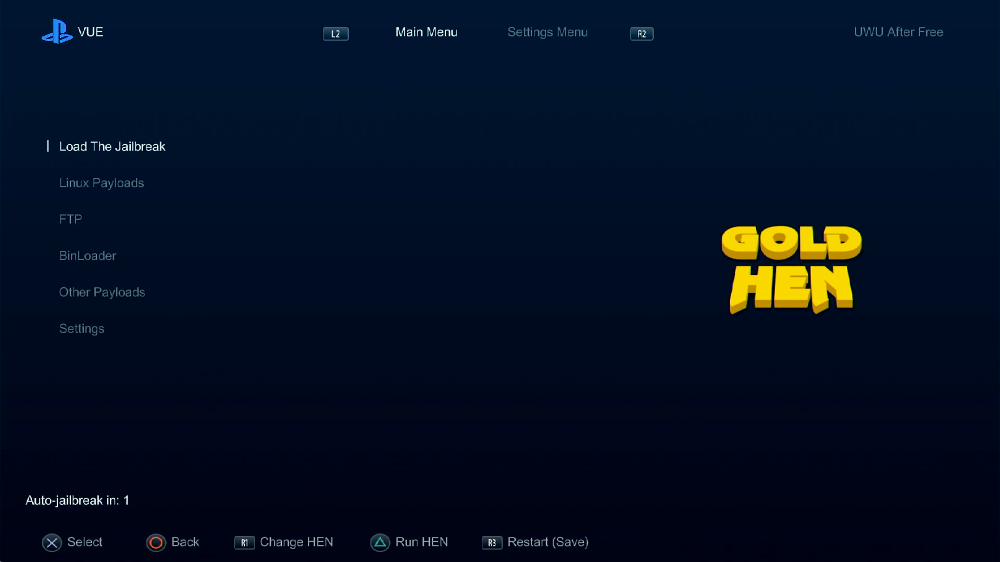

# PSVue Theming

A custom theme design for the PSVue application on the PS4 using MITM attack to inject custom js to build the UI. Targeting PSVue version 1.01
#### This is only a design and not an exploit.

## Features
*   **Theming System:** 
*   **Menu Items:** Built-in menu items for the use of:
    *   **Listing menus for navigation**
    *   **Keybinding for entering/leaving a menu or executing an action or shortcuts**
    *   **Header Tabs**
    *   **Icons next to footer**
*   **Auto-Jailbreak (Concept only):** Countdown timer to automatically load your preferred HEN Payload on startup.
*   **Persistent Settings:**
    *   **Southbridge/PS4 Model:** Customize the display for your specific console (Fat/Slim/Pro). Useful for payloads such as Linux Payloads.
    *   **UI Customization:** Toggle between different slider styles (Side Indicator / Bottom Underline).
    *   **Default HEN:** Remembers your last used HEN flavor.
    *   **Theme:** Remembers your last used theme.
        *   Note that the settings are stored in the browser's localStorage. Ensure you use the Restart (Save) option to apply changes fully

## Prerequisites

*   **Python**
*   **mitmproxy**: Used to intercept and rewrite PS4 traffic.
*   **A fake activated and Jailbroken PS4**: Connected to the same network as your PC.
    *   While you can launch PSVue and execute custom JavaScript code without a jailbreak, we need file access for the first time to copy necessary files that the default theme uses to the PS4 download0 folder of PSVue. 

## Installation & Usage

1.  **Clone the Repository:**
    ```bash
    git clone https://github.com/ArabPixel/psvue-theming.git
    cd psvue-theming
    ```

2.  **Start the Proxy Server:**
    Run the proxy script using `mitmproxy`. This will start a proxy on port 8080 (default).

*   **on Linux:**
    ```bash
    pipx install mitmproxy
    # OR
    pip install mitmproxy
    # Then run
    mitmproxy -s proxy.py
    ```

3.  **Start the Log Server (Optional):**
    If you want to see debug logs from the PS4 browser in your terminal:
    ```bash
    python log_server.py
    ```

4.  **Configure PS4 Network:**
    *   Go to **Settings** -> **Network** -> **Set Up Internet Connection**.
    *   Choose **Use Wi-Fi** or **Use LAN Cable**.
    *   Select **Custom**.
    *   **IP Address Settings:** Automatic.
    *   **DHCP Host Name:** Do Not Specify.
    *   **DNS Settings:** Automatic (or your preferred DNS).
    *   **MTU Settings:** Automatic.
    *   **Proxy Server:** **Use**.
    *   Enter your **PC's Local IP Address** (e.g., `192.168.1.x`) and Port **8080**.

5. **Copy files to the PSVue Application folder**
    *   Put localstorage.aes and themes folder in /mnt/sandbox/CUSA00960_000/download0/

6.  **Launch:**
    *   Open **PSVue 1.01** on your PS4.
    *   The proxy will intercept the request and load the local `inject.js`, displaying the PSVue theme menu.

## Project Structure

*   `inject.js`: The injected JavaScript file that will be executed on the PS4 to load the selected theme.
*   `main.js`: The core application logic. Handles UI rendering, input mapping, and payload triggers. **Should exist in every theme as the main file.**
*   `bypassPSN.js`: The bypassPSN.js file that will be executed on the PS4 to bypass the PSN check. Another approach is to load the [np-signin](https://github.com/earthonion/np-fake-signin) payload by [earthonion](https://github.com/earthonion).
*   `proxy.py`: The `mitmproxy` script. Intercepts specific file requests.
*   `log_server.py`: A simple HTTP server to receive and print logs sent from the PS4.
*   `download0/`: Directory for storing local theme assets (images, icons).
    *   Should be copied to the ps4 download0 folder of PSVue.

## Customization

You can modify `main.js` of default theme or add your own one to add your own menu items, change colors, or adjust the layout. The `Layout` object manages the positioning of elements, and the `Scene` object manages the menu states (Main Menu, Settings, etc.).

## Default Theme Screenshot



## Credits

*   **[earthonion](https://github.com/earthonion/Vue-mitm-poc)**: Original Vue MITM attack PoC, PSN bypass and for helping me with JSMAF.
*   **[ArabPixel](https://github.com/ArabPixel)**: UI/Theming and Logic implementation.
